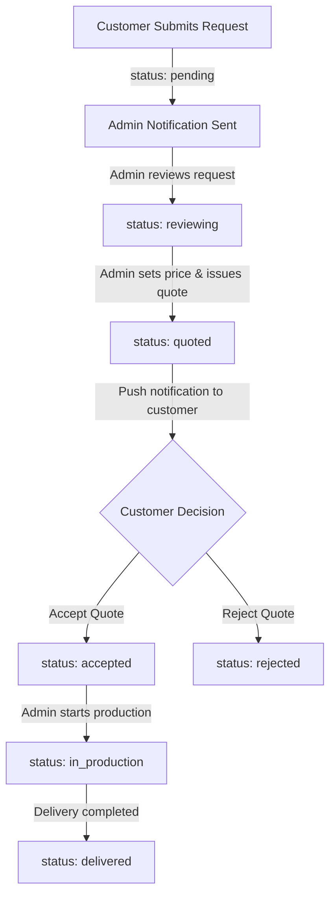

# 🎓 INWIN — Corporate Gifts & Events Platform (PFE Project)

> **Projet de Fin d'Études (PFE) / Graduation Thesis Project**  
> *From Idea to Realisation — Cross-Platform B2B Corporate Gifts, Interactive Mockup Customization & Event Planning Mobile System.*

---

## 📌 Project Overview

**INWIN** is a mobile and web ecosystem built to streamline corporate gifting and professional event management. The platform connects corporate clients with suppliers/administrators through an intuitive digital showcase featuring interactive 2D branding preview, custom quotation workflows, live messaging, and automated status notifications.

### 🌟 Key Highlights
- **Interactive 2D Product Configurator**: Drag, scale, rotate client logos directly onto customizable 3D-like mockups (Notebooks, Mugs, Tote Bags, Pens, Keychains, and Gift Sets).
- **Realistic Material Selection**: Live texture switching for notebook covers (Couverture Cartonnée, Carton Rigide, Couverture Tissu, Simili Cuir) with dynamic color tinting and highlight/shadow blending.
- **End-to-End Quotation Pipeline**: Multi-stage request lifecycle from quote request submission to supplier pricing, quote approval, production, and final delivery.
- **Dual-Role Access Control**: Separate user flows and dashboards for **Customers** (Browsing, Customizing, Quoting, Tracking) and **Admins** (Reviewing, Supplier Pricing, Quote Issuance, Production Status Updates).
- **Real-Time Messaging & Push Notifications**: In-app project chat powered by Cloud Firestore and instant push notifications via Firebase Cloud Messaging (FCM) & TypeScript Cloud Functions.

---

## 🏗 Architecture & Tech Stack

```
           📱 Flutter Mobile / Web App (iOS & Android)
                                ↕
    ┌───────────────────────────┼───────────────────────────┐
    │                           │                           │
🔐 Firebase Auth       🗄️ Cloud Firestore       📦 Firebase Storage
    (Authentication)    (Database & Chat)       (Logos & Assets)
                                ↕
               ⚡ Firebase Cloud Functions (TypeScript)
               ├── onRequestCreated   → Notify Admins
               ├── onRequestUpdated   → Notify Client on Status Change
               └── onMessageCreated   → Real-time Chat Notifications
```

### 🛠 Tech Stack
| Domain | Technology |
|---|---|
| **Framework** | [Flutter 3.x](https://flutter.dev) (Dart 3.x) |
| **State Management** | [Flutter Riverpod](https://riverpod.dev) |
| **Routing** | [GoRouter](https://pub.dev/packages/go_router) |
| **Backend & Cloud Services** | Firebase Auth, Firestore, Firebase Storage, Cloud Messaging (FCM) |
| **Serverless Pipeline** | Node.js / TypeScript Cloud Functions |
| **UI Components & Icons** | Google Fonts (Inter), Lucide Icons, Custom Painter Canvas |

---

## 📁 Project Structure

```
lib/
├── main.dart                          # App Entrypoint & Firebase Initialization
├── core/
│   ├── constants/                     # Theme, Colors, Typography, Spacing
│   ├── models/                        # AppUser, QuoteRequest, Message
│   ├── services/                      # AuthService, RequestService, StorageService, Messaging
│   ├── router/                        # AppRouter (Role-based ShellRoute)
│   └── widgets/                       # Reusable UI components & badges
└── features/
    ├── auth/                          # SplashScreen, LoginScreen, RegisterScreen
    ├── home/                          # HomeShell, Dashboard & Shortcuts
    ├── gifts/                         # Catalog & GiftConfiguratorScreen (2D Positioner & Textures)
    ├── events/                        # EventsScreen & EventFormScreen
    ├── projects/                      # Customer Projects, Detail & Messaging
    ├── profile/                       # Settings, Profile Management & Logout
    └── admin/                         # Admin Dashboard, Request Filter & Quote Manager
```

---

## 🔄 Request Lifecycle & Workflow



---

## 📋 Firestore Data Architecture

```
users/{uid}
  ├── fullName, companyName, email, phone, role (customer | admin)
  └── fcmToken, photoUrl, createdAt

requests/{requestId}
  ├── customerId, customerName, companyName, type (gift | event), status
  ├── details { category, model, material, quantity, location, logoPositions }
  ├── attachmentUrls[], supplierPrice, quotedPrice, adminNote, customerNote
  └── createdAt, updatedAt
      │
      └── messages/{messageId}
            ├── senderId, senderName, isAdmin, text, attachments[]
            └── createdAt, isRead
```

---

## 🚀 Setup & Developer Installation

### Prerequisites
- [Flutter SDK](https://docs.flutter.dev/get-started/install) (v3.0 or higher)
- [Dart SDK](https://dart.dev/get-started) (v3.0 or higher)
- Node.js & npm (for Cloud Functions deployment)
- Firebase CLI (`npm install -g firebase-tools`)

### 1. Clone & Setup Dependencies
```bash
# Clone the repository
git clone https://github.com/YOUR_USERNAME/inwin_app.git
cd inwin_app

# Fetch Flutter dependencies
flutter pub get
```

### 2. Configure Firebase
1. Create a Firebase project at the [Firebase Console](https://console.firebase.google.com).
2. Enable **Authentication** (Email/Password), **Cloud Firestore**, **Storage**, and **Cloud Messaging**.
3. Activate the FlutterFire CLI to generate your credentials:
   ```bash
   dart pub global activate flutterfire_cli
   flutterfire configure
   ```
4. Alternatively, rename `lib/firebase_options.dart.example` to `lib/firebase_options.dart` and add your Firebase credentials.

### 3. Deploy Cloud Functions & Security Rules
```bash
cd functions
npm install
npm run build

# Deploy Cloud Functions & Security Rules
firebase deploy --only functions,firestore:rules,storage
```

### 4. Run the Application
```bash
# Target Android, iOS, or Web
flutter run
```

---

## 🎓 Academic Context & Credits

This project was developed as a **Projet de Fin d'Études (PFE)** / Graduation Project.

- **Author / Student**: [Your Name]
- **Academic Institution**: [Your University / Faculty Name]
- **Degree Program**: [Degree / Diploma Name]
- **Academic Supervisor**: [Supervisor Name]
- **Company / Host Partner**: INWIN

---

## 📄 License

Distributed under the MIT License. See [`LICENSE`](./LICENSE) for details.
